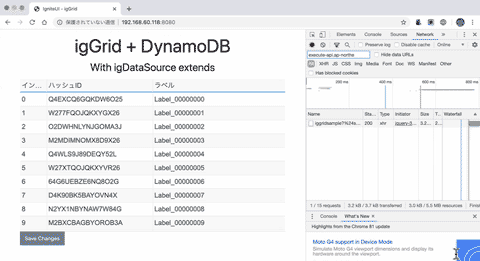
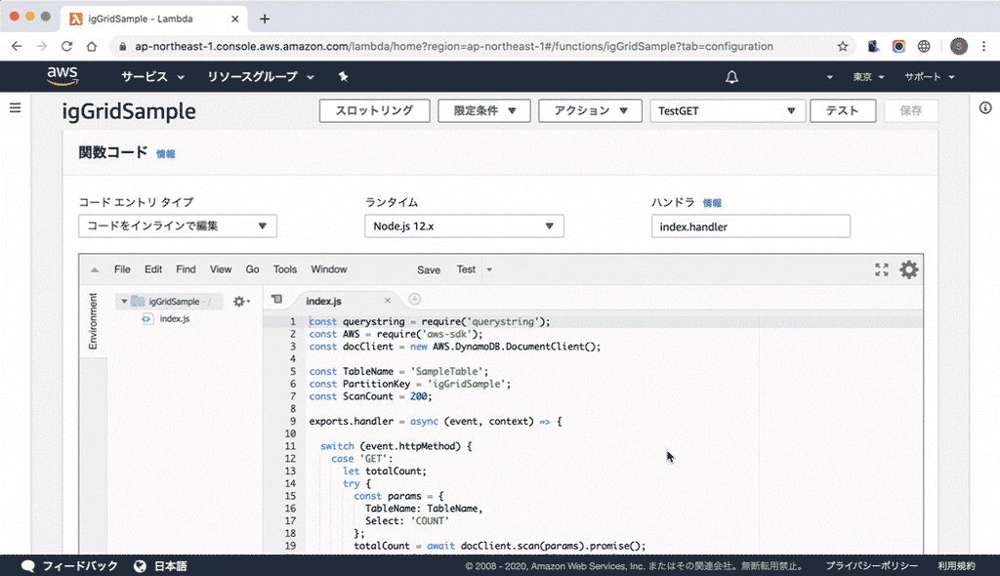
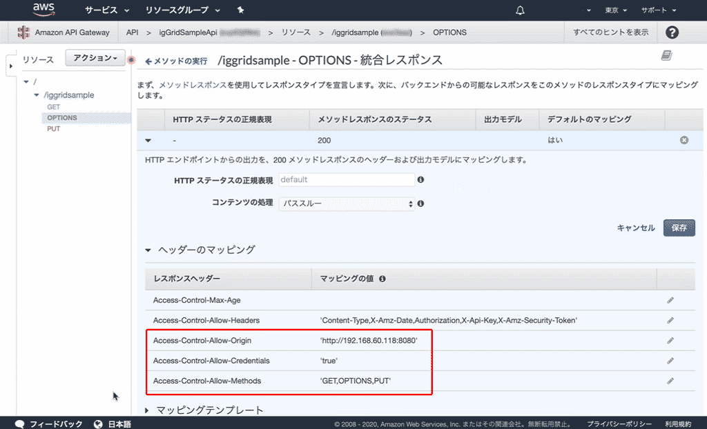

# igsample-iggrid-dynamodb

[Ignite UI for JavaScript](https://jp.infragistics.com/products/ignite-ui) の igGrid グリッドコンポーネントを利用して、AWS DynamoDB に格納されたデータを LastEvaluatedKey を使用した順次スキャンによってデータを読み込むサンプルです。
このサンプルの目的は、AWS のデータストレージサービスと Ignite UI の併用をご紹介することだけでなく、Ignite UI の持つデータソース機能 (igDataSource) の独自拡張によって、複雑な既存システムや独自のAPIを有するサービスをデータソースとして利用していく際の手がかりとしてご利用頂くことです。



## 前提条件

本サンプルを実行するにあたり、以下の環境をご用意ください。

- [Node.js](https://nodejs.org/ja/)をインストールしたローカル環境 (比較的新しいLTSバージョン / OSは問いません)
- Chrome、Edge Chromium (できる限り新しいバージョン)
- DynamoDB および Lambda、API Gatewayに関わる操作が可能かつ APIキーを有する AWS アカウント (無償枠の利用で可能)

## 01_staticフォルダ

igGridを利用するための静的なHTMLファイルのサンプルです。
ブラウザ上で実行される igGrid などの Ignite UI ライブラリは、表示時に CDN より取得しますので、インターネットに接続できる環境でご覧ください。
なお表示を行うには、index.html をローカルファイル(file://)として読み込むか、Node.js の [http-server](https://github.com/http-party/http-server#readme) を利用することをお勧めします。
```
$ npm install -g http-server
$ http-server (pathto /01_static) -c0
(-> access to http://127.0.0.1:8080/ with your browser)
```

## 02_awsフォルダ

#### importdata.js
このJavaScriptファイルは、ローカル環境から Node.js と AWS SDK を利用してランダムなデータをDynamoDBに書き込むサンプルです。
利用の際は、コマンドライン(コンソール)にて npm install してから実行します。
```
$ cd (pathto /02_aws)
$ npm install
...
$ node importdata.js
```
なお、接続先のAWSアカウント情報はローカルのユーザ環境にあらかじめ設定しておくか、importdata.js に直接記述して実行できます。(セキュリティ保全に関して等、十分にご留意ください。)

- [SDK for JavaScript の設定](https://docs.aws.amazon.com/ja_jp/sdk-for-javascript/v2/developer-guide/configuring-the-jssdk.html)
- importdata.js に直接記述(以下参照)
```
(6行目付近)
//https://docs.aws.amazon.com/ja_jp/sdk-for-javascript/v2/developer-guide/setting-credentials-node.html
//AWS.config.update({accessKeyId: '...', secretAccessKey: '...', region:'ap-northeast-1'});
```
↓
```
(6行目付近)
//https://docs.aws.amazon.com/ja_jp/sdk-for-javascript/v2/developer-guide/setting-credentials-node.html
AWS.config.update({
  accessKeyId: '(your Access key ID)',
  secretAccessKey: '(Secret access key)',
  region:'(region)'
});
```

#### _lambda.js
このファイルは AWS Lambda の関数(Node.jsランタイム)として作成するためのコードです。
この関数によって、DynamoDBのデータとigDataSourceとの相互変換を行います。

Lambda関数作成時に関数コードとして貼り付けるか、S3経由などでファイルを送り込んでご利用ください。


## 04_iggridフォルダ

API(AWS Lambda の関数)からデータを igDataSource によって取得し、igGridを利用するための静的なHTMLファイルの、このサンプルの最終形です。
01_staticフォルダのコンテンツ同様、ブラウザ上で実行される igGrid などの Ignite UI ライブラリは、表示時に CDN より取得しますのでインターネットに接続できる環境で、Node.js の [http-server](https://github.com/http-party/http-server#readme) をご利用ください。
なお、表示の際、**ブラウザ上で実行されるJavaScriptとAWS上のAPIのドメインが異なるため、CORSの設定が必要になります。**

※画像中の Access-Control-Allow-Origin のURLは、お使いの環境のIPアドレスに合わせて適宜変更してください。
